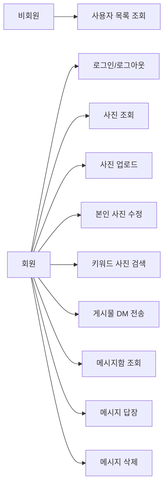
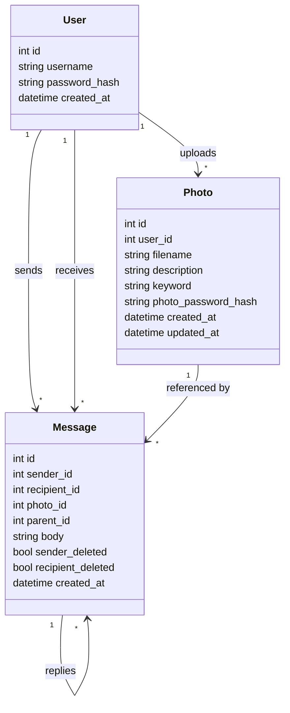

# UML 설계

## Use Case Diagram

```mermaid
flowchart LR
  Guest["비회원"] --> ViewUsers["사용자 목록 조회"]
  User["회원"] --> Login["로그인/로그아웃"]
  User --> ViewPhotos["사진 조회"]
  User --> UploadPhoto["사진 업로드"]
  User --> EditOwnPhoto["본인 사진 수정"]
  User --> SearchPhoto["키워드 사진 검색"]
  User --> SendDM["게시물 DM 전송"]
  User --> Inbox["메시지함 조회"]
  User --> ReplyDM["메시지 답장"]
  User --> DeleteDM["메시지 삭제"]
```

## Class Diagram

```mermaid
classDiagram
  class User {
    int id
    string username
    string password_hash
    datetime created_at
  }

  class Photo {
    int id
    int user_id
    string filename
    string description
    string keyword
    string photo_password_hash
    datetime created_at
    datetime updated_at
  }

  class Message {
    int id
    int sender_id
    int recipient_id
    int photo_id
    int parent_id
    string body
    bool sender_deleted
    bool recipient_deleted
    datetime created_at
  }

  User "1" --> "*" Photo : uploads
  User "1" --> "*" Message : sends
  User "1" --> "*" Message : receives
  Photo "1" --> "*" Message : referenced by
  Message "1" --> "*" Message : replies
```
